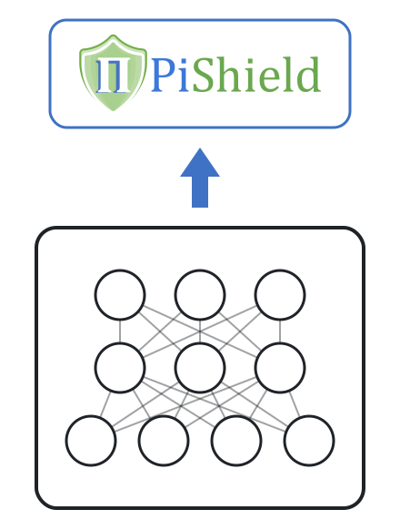

<h3 align="center">
  
  <br>
  A PyTorch Package for Learning with Requirements
</h3>


* :sparkles: [Description](#sparkles-description)
* :pushpin: [Dependencies](#pushpin-dependencies)
* :hammer_and_wrench: [Installation](#hammer_and_wrench-installation)
* :bulb: [Usage](#bulb-usage)
    - [Runnable examples](#bulb-usage)
    - [Supported requirement types](#supported-requirement-types)
    - [Training time: Shield Layer](#training-time-shield-layer)
    - [Inference only: Shield Layer](#inference-only-shield-layer)
    - [Bonus: Memory-efficient Loss](#training-time-memory-efficient-loss)
* :arrow_forward: [Demo video](#arrow_forward-demo-video)
* :fire: [Performance](#fire-performance)
  + [1. Autonomous Driving](#1-autonomous-driving)
  + [2. Tabular Data Generation](#2-tabular-data-generation)
  + [3. Functional Genomics](#3-functional-genomics)
* [Authorship and maintenance](#authorship-and-maintenance)
* :memo: [References](#memo-references)


**Update**: DRL [4] is now part of PiShield's main branch! PiShield now natively supports **QFLRA** (quantifier-free linear real arithmetic) requirements, in addition to the **linear** and **propositional** requirements previously supported. The framework also ships with a **Memory-efficient Loss** (a memory-efficient t-norm loss [5] inspired by Logic Tensor Networks, LTN [6]) to encourage requirement satisfaction at training time via t-norms.

## :sparkles: Description

<picture>
  <source media="(prefers-color-scheme: dark)" srcset="./extra/overview-dark.svg">
  
</picture>

Update: PiShield's **website** is now available [here](https://mihaela-stoian.github.io/PiShield/).

PiShield is the first framework ever allowing for the integration of the requirements into the neural networks' topology.

:white_check_mark: The integration happens in a straightforward and efficient manner and allows for the creation of deep learning models that are guaranteed to be compliant with the given requirements, no matter the input.

:pencil2: The requirements can be integrated both at inference and/or training time, depending on the practitioners' needs.

## :pushpin: Dependencies
PiShield requires Python 3.8 or later and PyTorch.

*Optional step*: conda environment setup, using cpu-only PyTorch here. Different PyTorch versions can be specified following the instructions [here](https://pytorch.org/get-started/locally/).
```
conda create -n "pishield" python=3.11 ipython 
conda activate pishield

conda install pytorch cpuonly -c pytorch 
pip install -r requirements.txt
```

## :hammer_and_wrench: Installation
From the root of this repository, containing `setup.py`, run:
```
pip install .
```

## :bulb: Usage

PiShield exposes two main entry points:
- `build_shield_layer` (from `pishield.shield_layer`) builds a **Shield Layer**, a differentiable layer that corrects a model's outputs so that they are *guaranteed* to satisfy the given requirements. It can be used both at inference time and at training time.
- `build_shield_loss` (from `pishield.shield_loss`) builds the **Memory-efficient Loss**, an additional loss term that *encourages* (but does not guarantee) requirement satisfaction at training time, using t-norms. It is a memory-efficient t-norm loss [5] inspired by Logic Tensor Networks (LTN) [6].

> :rocket: **Runnable examples.** Try all three examples in one click, with no local setup:
> [](https://colab.research.google.com/github/mihaela-stoian/PiShield/blob/main/examples/general_usage/PiShield_quickstart.ipynb)
>
> The [`PiShield_quickstart.ipynb`](examples/general_usage/PiShield_quickstart.ipynb) notebook bundles the three examples below and installs PiShield automatically on Colab. The [`examples/general_usage`](examples/general_usage) folder also contains them as standalone notebooks that run end-to-end with no external downloads:
> - [`shield_layer_inference.ipynb`](examples/general_usage/shield_layer_inference.ipynb) — correct a network's predictions with a Shield Layer.
> - [`shield_layer_training.ipynb`](examples/general_usage/shield_layer_training.ipynb) — train a model with a Shield Layer (and compare against an unconstrained baseline).
> - [`shield_loss.ipynb`](examples/general_usage/shield_loss.ipynb) — encourage requirement satisfaction with the Memory-efficient Loss.
> - [`examples/shield_layer_hierarchical.ipynb`](examples/shield_layer_hierarchical.ipynb) trains and tests a hierarchical multi-label classifier on the real cellcycle dataset, reproducing C-HMCNN [3] (also one-click on Colab).

### Supported requirement types

The Shield Layer supports four types of requirements, specified as `requirements_type`:

| `requirements_type` | Description | Example line |
|---------------------|-------------|--------------|
| `hierarchical`      | Class hierarchies (subsumption): whenever a class holds, all of its ancestors hold.| `0 :- 1` (if class `1` holds, its parent `0` holds) |
| `propositional`     | Propositional (Boolean) constraints, written either as Horn rules (`head :- body`) or as disjunctive clauses. | `0 :- 1 n2` or `y_0 or not y_1 or y_2` |
| `linear`            | Linear inequality constraints over real variables. | `y_0 - y_1 >= 0` |
| `qflra`             | Quantifier-free linear real arithmetic: disjunctions (`or`) and negations (`neg`) of linear inequalities [4]. | `y1 - 2y2 > 0 or neg y3 >= 0` |

Hierarchical requirements are positive Horn rules `parent :- child` describing the class hierarchy (a subset of the propositional format). Alternatively, pass an **`.arff` dataset file** directly — the common format for hierarchical multi-label datasets such as the FUN/GO benchmarks: PiShield reads the hierarchy from the file's header (auto-detecting whether it is stored as full root-to-node **paths** or as **parent/child edges**; override with `arff_hierarchy_style='paths'` or `'edges'`).

In the propositional Horn format, literals are variable indices, with an `n` prefix denoting negation (e.g. `n2` is the negation of variable `2`); in the clause format, literals are written as `y_<index>` and negated with `not`.

By default `requirements_type='auto'`, in which case PiShield inspects the requirements file and selects the appropriate layer automatically (an `.arff` file is always read as `hierarchical`). When in doubt — in particular for propositional clauses, whose `or` keyword overlaps with the QFLRA syntax, or for hierarchical `.txt` rules, which are also valid propositional files — pass `requirements_type` explicitly.

Each requirements file must start with an `ordering` line listing the variables. For example, a file `example_constraints_tabular.txt` with linear requirements:
```
ordering y_0 y_1 y_2
-y_0 >= -3
y_0 >= 3
y_0 - y_1 >= 0
-y_0 - y_2 >= 0
```

The signature of `build_shield_layer` is:
```
build_shield_layer(
    num_variables: int,            # number of variables, matching the last dimension of the tensors to correct
    requirements_filepath: str,    # path to a txt file (or an .arff dataset, for hierarchical) with the requirements
    ordering_choice: str = 'given',# 'given', 'random', or a custom ordering
    custom_ordering: List = None,  # optional custom ordering (propositional only)
    requirements_type='auto',      # 'auto', 'hierarchical', 'propositional', 'linear' or 'qflra'
    arff_hierarchy_style='auto',   # for .arff hierarchical files: 'auto', 'paths' or 'edges'
)
```

### Training time: Shield Layer
The Shield Layer is differentiable, hence it can be applied *during* training: build it once (typically in the model's constructor with `build_shield_layer`) and apply it to the model's raw outputs before computing the loss. Because gradients flow back through the correction, the model learns to produce outputs that already satisfy the requirements. This is how, for instance, the Shield Layer constrains a deep generative model for tabular data [1], where the outputs have no ground-truth labels.

In a **fully supervised** setting — the typical case for `propositional` and `hierarchical` requirements, where every output has a ground-truth label — you should also pass the labels to the layer as `goal`:
```
corrected = shield_layer(model_output, goal=labels)
loss = criterion(corrected, labels)
```
The reason is that the Shield Layer enforces a requirement by *propagating* scores between the variables it links — for example, in the hierarchical case a class's corrected score becomes the maximum over its own subtree, so a descendant can raise its ancestors. If this propagation used the predictions alone, the model could satisfy a requirement through the *wrong* variable: a false-positive descendant could pull its parent up to match a positive parent label, so the loss would never penalise (and the model would never learn to fix) the actual mistake. Passing the ground truth as `goal` makes the correction respect which variables are truly active in each example, so the gradient is directed at the prediction that genuinely needs to change. Concretely, the hierarchical layer corrects a *positive* class with the maximum over its **true** descendants (`goal * predictions`), pushing the model to raise a genuinely relevant descendant rather than accept a spurious one, and a *negative* class with the ordinary correction — this reproduces C-HMCNN's max-constraint loss [3].

For a full supervised example, see [`examples/shield_layer_hierarchical.ipynb`](examples/shield_layer_hierarchical.ipynb), which trains and tests a hierarchical multi-label classifier on the cellcycle dataset.

### Inference only: Shield Layer
The Shield Layer can also be used purely at inference, to make an **already-trained** model's outputs satisfy the requirements without retraining — for example, to constrain a model you cannot or do not want to fine-tune. You build the layer once and apply it to the model's predictions; no `goal` and no gradients are involved. For instance, with linear requirements:
```
import torch
from pishield.shield_layer import build_shield_layer

predictions = torch.tensor([[-5., -2., -1.]])
constraints_path = 'example_constraints_tabular.txt'

num_variables = predictions.shape[-1]
shield_layer = build_shield_layer(num_variables, constraints_path)

# correct the predictions so they satisfy the requirements
corrected_predictions = shield_layer(predictions.clone())  # tensor([[ 3., -2., -3.]]), which satisfies the constraints
```

### Bonus: Memory-efficient Loss
PiShield also provides a **Memory-efficient Loss** for **propositional** requirements — a memory-efficient t-norm loss [5] inspired by Logic Tensor Networks (LTN) [6]. The loss adds a penalty term computed via a t-norm (`godel`, `product` or `lukasiewicz`) that pushes the model towards satisfying the requirements. In order to make keep the memory requirements at a minimum, the loss is implemented using sparse matrices.

The Memory-efficient Loss expects requirements in the Horn-rule format `<id> <head> :- <body>`, where `<id>` is a constraint identifier, and the head and body literals are variable indices (with an `n` prefix denoting negation). For example, a file `example_requirements.txt`:
```
c0 0 :- 1 n2
c1 1 :- 0
```
It is then used as follows:
```
import torch
from pishield.shield_loss import build_shield_loss

num_variables = predictions.shape[-1]
shield_loss = build_shield_loss(num_variables, 'example_requirements.txt', tnorm_choice='godel')

# preds are probabilities in [0, 1]; the returned scalar can be added to the task loss
requirement_loss = shield_loss(preds)
total_loss = task_loss + requirement_loss
```


## :arrow_forward: Demo video

A demo video is available for download [here](https://github.com/mihaela-stoian/PiShield/blob/main/extra/video.mp4).


## :fire: Performance

### 1. Autonomous Driving

In [2], we considered standard 3D-RetinaNet models with different temporal learning architectures such as I3D, C2D, RCN, RCGRU, RCLSTM, and SlowFast, and compared each of these with their constrained versions.
The constrained versions inject propositional background knowledge into the models via a constrained layer, as we call it in [2], which is equivalent to a Shield layer when using PiShield.

Below we report the aggregated performance from Table 2 of our paper [2] to show the results we obtained according to the f-mAP (framewise mean Average Precision) measure, at IOU (Intersection-over-Union) threshold of 0.5. 
The best results are in **bold**.

As we can see, the models incorporating background knowledge through **Shield layers** outperform their standard counterparts.

| 	          | Baseline 	 | <span style="color:darkgreen">Shielded</span>  	 |
|------------|------------|--------------------------------------------------|
| I3D      	 | 29.30    	 | **30.98**     	                                  |
| C2D      	 | 26.34    	 | **27.93**     	                                  |
| RCN      	 | 29.26    	 | **30.02**     	                                  |
| RCGRU    	 | 29.24    	 | **30.50**     	                                  |
| RCLSTM   	 | 28.93    	 | **30.42**     	                                  |
| SlowFast 	 | 29.73    	 | **31.88**     	                                  |
|___________ |
| AVERAGE    | 	28.80	    | **30.29**	                                       |																						


### 2. Tabular Data Generation

In [1], we compared standard deep generative models with their respective constrained versions, which use linear inequality constraints.
The latter are the models to which we added a constraint layer, as we call it in [1], which is equivalent to a Shield layer when using PiShield.

Below we reproduce Table 2 of our paper [1] to show the results we obtained according to two standard measures for tabular data generation benchmarks: utility and detection.
For each of these two measures, we report the performance using three metrics: F1-score (F1), weighted F1-score (wF1), and Area Under the ROC Curve (AUC).
The best results are in bold.

As we can see, in 28/30 cases, the models incorporating background knowledge through **Shield layers** outperform their standard counterparts.

|                                                    |            | Utility(**&uarr;**) |             |            | Detection(**&darr;**) |           |               
|----------------------------------------------------|------------|---------------------|-------------|------------|--------------------|-----------|
|                                                    | F1         | wF1                 | AUC         | F1         | wF1                | AUC       |
| WGAN                                               | 0.463      | 0.488               | 0.730       | 0.945      | 0.943              | 0.954     |
| <span style="color:green">Shielded-WGAN</span>     | **0.483**  | **0.502**           | **0.745**   | **0.915**  | **0.912**          | **0.934** |
| TableGAN                                           | 0.330      | 0.400               | 0.704       | 0.908      | 0.907              | 0.926     |
| <span style="color:green">Shielded-TableGAN</span> | **0.375**  | **0.432**           | **0.714**   | **0.898**  | **0.895**          | **0.917** |
| CTGAN                                              | **0.517**  | 0.532               | 0.771       | 0.902      | 0.901              | 0.920     |
| <span style="color:green">Shielded-CTGAN</span>    | 0.516      | **0.537**           | **0.773**   | **0.894**  | **0.891**          | **0.919** |
| TVAE                                               | 0.497      | 0.527               | 0.767       | 0.869      | 0.868              | **0.892** |
| <span style="color:green">Shielded-TVAE</span>     | **0.507**  | **0.537**           | **0.773**   | **0.868**  | **0.867**          | 0.898     |
| GOGGLE                                             | 0.344      | 0.373               | 0.624       | 0.926      | 0.926              | 0.943     |
| <span style="color:green">Shielded-GOGGLE</span>   | **0.409**  | **0.427**           | **0.667**   | **0.925**  | **0.916**          | **0.937** |
| ________________                                   |
| AVERAGE Baseline	                                  | 0.430	     | 0.464               | 	0.719	     | 0.910	     | 0.909              | 	0.927    |
| AVERAGE Shielded 	                                 | **0.458**	 | **0.487**           | 	**0.734**	 | **0.900**	 | **0.896**	         | **0.921** |

### 3. Functional Genomics

In our paper [3], we compared the performance of baseline models with their constrained counterparts.
The latter are the models to which we added a constraint layer, as we call it in [3], which is equivalent to a Shield layer when using PiShield.

Below we aggregated the results from Table 3 of [3] and reported the performance in terms of the area under the average precision and recall curve (AU(PRC)), which is a standard metric used in functional genomics.
As we can see, the models **Shield layers** outperform their standard counterparts.


| Dataset    | Baseline* | PiShield**  |
|------------|-----------|-----------|
| CELLCYCLE  | 0.220     | **0.232** |
| DERISI     | 0.179     | **0.182** |
| EISEN      | 0.262     | **0.285** |
| EXPRE      | 0.246     | **0.270** |
| GASCH1     | 0.239     | **0.261** |
| GASCH2     | 0.221     | **0.235** |
| SEQ        | 0.245     | **0.274** |
| SPO        | 0.186     | **0.190** |
| __________ |
| AVERAGE    | 0.225     | **0.241** |

*Note: All baselines for the functional genomics scenario have a postprocessing step included, as functional genomics tasks always require that the constraints are satisfied.

**Note: The results reported here differ from those in [3], as the C-HMCNN model in [3] is further retrained on the combined training and validation sets.

## Authorship and maintenance

- Created by [**Mihaela Cătălina Stoian**](https://mihaela-stoian.github.io/) [[Homepage]](https://mihaela-stoian.github.io/)[[GitHub]](https://github.com/mihaela-stoian)[[LinkedIn]](https://www.linkedin.com/in/mihaela-catalina-stoian-919b27bb/)[[Google Scholar]](https://scholar.google.com.co/citations?user=B_48apwAAAAJ&hl=en) in 2024, during her DPhil at the University of Oxford.
- Maintained solely by **Mihaela C. Stoian** since its creation and, since October 2025, as a Research Associate in the [Data, Uncertainty, Constraints and Knowledge (DUCK) Lab](https://the-duck-lab.github.io/) at Imperial College London.
- The Shield Layer for propositional constraints was developed by **Mihaela C. Stoian** and **Alex Tatomir**.
- Based on papers written with the following collaborators, without whom this package would not have been possible:
  - Eleonora Giunchiglia [[Homepage]](https://the-duck-lab.github.io/members/Eleonora_Giunchiglia.html)[[GitHub]](https://github.com/EGiunchiglia)[[LinkedIn]](https://www.linkedin.com/in/eleonora-giunchiglia-3063b5164/)[[Google Scholar]](https://scholar.google.com/citations?user=HAgGqScAAAAJ&hl=it)
  - Alex Tatomir [[GitHub]](https://github.com/atatomir)[[LinkedIn]](https://www.linkedin.com/in/atatomir/)[[Google Scholar]](https://scholar.google.com/citations?user=DrGgfBwAAAAJ)
  - Salijona Dyrmishi [[Homepage]](https://salijona.github.io/)[[LinkedIn]](https://www.linkedin.com/in/salijona-dyrmishi-09089385)[[Google Scholar]](https://scholar.google.com/citations?user=nHDj8SIAAAAJ)
  - Maxime Cordy [[Homepage]](https://maxcordy.github.io/)[[GitHub]](https://github.com/serval-uni-lu)[[LinkedIn]](https://www.linkedin.com/in/maxime-cordy-7a523569/)[[Google Scholar]](https://scholar.google.com/citations?user=sRXHjkIAAAAJ&hl=en)
  - Thomas Lukasiewicz [[Google Scholar]](https://scholar.google.co.uk/citations?user=arjucpEAAAAJ&hl=en)

## Citing PiShield

If you use PiShield, please cite:

```bibtex
@inproceedings{ijcai2024p1037,
  title     = {PiShield: A PyTorch Package for Learning with Requirements},
  author    = {Stoian, Mihaela C. and Tatomir, Alex and Lukasiewicz, Thomas and Giunchiglia, Eleonora},
  booktitle = {Proceedings of the Thirty-Third International Joint Conference on
               Artificial Intelligence, {IJCAI-24}},
  publisher = {International Joint Conferences on Artificial Intelligence Organization},
  editor    = {Kate Larson},
  pages     = {8805--8809},
  year      = {2024},
  month     = {8},
  note      = {Demo Track},
  doi       = {10.24963/ijcai.2024/1037},
  url       = {https://doi.org/10.24963/ijcai.2024/1037},
}
```

Depending on which feature you use, please additionally cite: the Shield Layer with hierarchical requirements [3], with propositional requirements [2], with linear requirements [1], or with QFLRA requirements [4]; and the Memory-efficient Loss with propositional requirements [5] (in addition to LTN [6]).

## :memo: References

[1] Mihaela Catalina Stoian, Salijona Dyrmishi, Maxime Cordy, Thomas Lukasiewicz, Eleonora Giunchiglia. How Realistic Is Your Synthetic Data? Constraining Deep Generative Models for Tabular Data. arXiv:2402.04823. In Proc. of International
Conference on Learning Representations (ICLR), 2024.

[2] Eleonora Giunchiglia, Alex Tatomir, Mihaela Catalina Stoian, Thomas Lukasiewicz. CCN+: A neuro-symbolic framework for deep learning with requirements. International Journal of Approximate Reasoning, 2024.

[3] Eleonora Giunchiglia and Thomas Lukasiewicz. Coherent Hierarchical Multi-Label Classification Networks. In Proceedings of Neural
Information Processing Systems, 2020.

[4] Mihaela Catalina Stoian and Eleonora Giunchiglia. Beyond the Convexity Assumption: Realistic Tabular Data Generation under Quantifier-Free Real Linear Constraints. In Proc. of International Conference on Learning Representations (ICLR) 2025.

[5] Mihaela Catalina Stoian, Eleonora Giunchiglia, Thomas Lukasiewicz. Exploiting T-norms for Deep Learning in Autonomous Driving. arXiv:2402.11362. In Proc. of the International Workshop on Neural-Symbolic Learning and Reasoning (NeSy), 2023.

[6] Samy Badreddine, Artur d'Avila Garcez, Luciano Serafini, Michael Spranger. Logic Tensor Networks. arXiv:2012.13635. Artificial Intelligence, 303, 2022.

